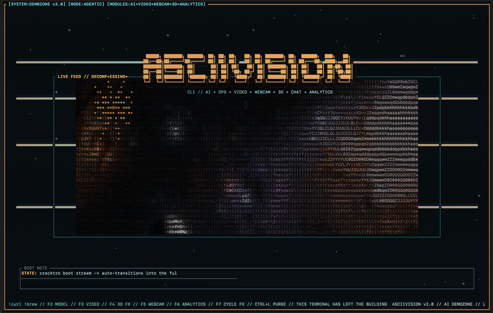

# ASCIIVision v2.0 -- All-In-One Terminal Powerhouse

> Agentic AI chat, live ASCII video, webcam streaming, WebSocket video chat, 3D terminal effects, Hyprland-style tiling, system monitoring, conversation analytics -- all in one terminal app.



---

## What Is This

ASCIIVision is a single Rust binary that packs an absurd amount of functionality into your terminal:

- **Multi-AI Chat** -- Claude Haiku 4.5, Grok 4 Fast, GPT-5 Nano, Gemini 3 Flash, and local Ollama models with live provider switching
- **Streaming Responses** -- AI responses appear character-by-character in real-time via SSE streaming (Claude, OpenAI, Grok), with seamless tool-use handoff mid-stream
- **Agentic Tool Use** -- AI can autonomously execute shell commands, read/write files, search codebases, make HTTP requests, and query system info with configurable approval gates
- **Shell Execution** -- run any bash command inline with `!<cmd>`, plus `/curl` and `/brew` shortcuts
- **ASCII Video Playback** -- MP4 files and streamed YouTube sources decoded to real-time colored ASCII art via FFmpeg
- **Live Webcam** -- your camera feed converted to ASCII art in real-time, with error reporting when the device is busy
- **WebSocket Video Chat** -- host or join multi-user live ASCII video chat rooms
- **3D Terminal Effects** -- rainbow matrix rain, plasma fields, 3D starfield, wireframe rotating cube, fire simulation, particle storms
- **Tiles Window** -- real PTY-backed embedded terminals for Codex, Claude, Gemini, shells, and any other CLI app, in 1-8 way grids
- **Hyprland-Style Tiling** -- move, swap, resize, and reassign panels with Ctrl+hjkl keybindings and 6 layout presets
- **Games Window** -- playable Pac-Man, Space Invaders, and 3D Penguin inside a focused tile with selector + WASD controls
- **System Monitor** -- live CPU, memory, swap, network I/O, load average, per-core sparklines
- **Conversation Analytics** -- real-time stats dashboard with message counts, provider breakdown, bar charts
- **Context Management** -- automatic summarization of older messages when the context window fills up, @-file injection, pinnable messages, persistent agent memory across sessions
- **SQLite Persistence** -- all conversations and agent memory saved to `~/.config/asciivision/conversations.db`
- **Cracktro Intro** -- animated boot sequence with starburst effects, raster bars, and scrolling ticker
- **Dynamic Theme Engine** -- global color theme system with HSL-based random palette generation. F9 randomizes all UI colors on the fly, F10 resets to defaults. Every panel, border, accent, and background color is driven by the live theme.

Legacy companion apps (mega-cli, mega-analytics) are preserved in the `archive/` directory.

---

## Quick Start

### One-Line Install (Recommended)

The install script handles everything -- Rust, FFmpeg, LLVM, `yt-dlp`, Ollama, building, and adding `asciivision` to your PATH:

```bash
git clone https://github.com/lalomorales22/asciivision.git
cd asciivision
./install.sh
```

After installation, run from anywhere:

```bash
asciivision
```

The repo includes `demo-videos/demo.mp4` as the bundled intro/video sample, so the video bus works out of the box.

**Supported platforms:** macOS (Homebrew), Ubuntu/Debian, Fedora/RHEL, Arch Linux, openSUSE.
**Windows users:** Install [WSL2](https://learn.microsoft.com/en-us/windows/wsl/install) first (`wsl --install` in PowerShell), then run the commands above inside your WSL terminal.

### Manual Setup

If you prefer to install dependencies yourself:

#### Prerequisites

- **Rust** 1.70+ ([rustup.rs](https://rustup.rs))
- **FFmpeg** dev libraries
- **LLVM/libclang** (needed to compile ffmpeg-sys-next)
- **pkg-config**
- **yt-dlp** (for `/youtube`)
- **Ollama** (for local model routing)

```bash
# macOS
brew install ffmpeg llvm pkg-config yt-dlp ollama

# Ubuntu/Debian
sudo apt install libavformat-dev libavcodec-dev libswscale-dev libavutil-dev libavdevice-dev pkg-config libclang-dev build-essential yt-dlp

# Fedora (enable RPM Fusion first)
sudo dnf install ffmpeg-devel clang-devel pkg-config gcc yt-dlp

# Arch
sudo pacman -S ffmpeg clang pkg-config base-devel yt-dlp

# Ollama (Linux / WSL2 manual install)
curl -fsSL https://ollama.com/install.sh | sh
```

#### Build & Run

```bash
# From the repo root (auto-builds + runs)
./asciivision

# Or manually
cargo build --release
./target/release/asciivision
```

### API Keys (Optional)

Copy `.env.example` to `.env` in the repo root and fill in your keys:

```bash
cp .env.example .env
```

Then edit `.env`:

```
CLAUDE_API_KEY=sk-ant-...
GROK_API_KEY=xai-...
OPENAI_API_KEY=sk-...
GEMINI_API_KEY=AIza...
```

Only the providers you want to use need keys. The app works without any keys -- shell, video, webcam, effects, tiling, sysmon, and local Ollama routing all work standalone.

---

## AI Models

| Provider | Model | Display Name |
|----------|-------|-------------|
| Anthropic | `claude-haiku-4-5` | Claude Haiku 4.5 |
| xAI | `grok-4-fast-non-reasoning` | Grok 4 Fast |
| OpenAI | `gpt-5-nano` | GPT-5 Nano |
| Google | `gemini-3-flash-preview` | Gemini 3 Flash |
| Ollama | installed models on this machine | Numbered local model picker |

Cycle between providers with F2 or `/provider <name>`. When you land on Ollama, ASCIIVision queries your local installed models and opens a numbered picker. Type the model number and press Enter to route chat into that model.

---

## CLI Flags

```
asciivision [OPTIONS]

Options:
  --provider <NAME>          AI provider: claude, grok, gpt, gemini, ollama [default: claude]
  --background-video <PATH>  MP4 file for the video panel
  --intro-video <PATH>       MP4 file for the intro sequence
  --skip-intro               Jump straight to the command deck
  --no-video                 Disable all video decoding
  --no-db                    Disable SQLite persistence
  --serve <PORT>             Start a WebSocket video chat server on this port
  --connect <URL>            Connect to a video chat server (ws://host:port)
  --username <NAME>          Username for video chat [default: anon]
  --webcam                   Enable webcam capture on startup
  --effects                  Start with 3D effects active
```

---

## Keyboard Controls

### Core

| Key | Action |
|-----|--------|
| `F1` | Help overlay |
| `F2` | Cycle AI provider (Claude, Grok, GPT-5, Gemini, Ollama) |
| `F3` | Toggle video panel |
| `F4` | Cycle 3D effects, then off, then repeat |
| `F5` | Toggle webcam capture |
| `F6` | Cycle tiling layout preset |
| `F7` | Boot/focus the Tiles PTY panel |
| `F8` | Cycle focused tile's panel type |
| `F9` | Randomize color theme |
| `F10` | Reset theme to defaults |
| `Ctrl+L` | Clear transcript |
| `Ctrl+C` | Exit |
| `Esc` | Exit (if input empty) / Clear input (if typing) |
| `PgUp/PgDn` | Scroll transcript |
| `Number + Enter` | Choose an Ollama model while the picker is open |

### Tiling (Hyprland-style)

| Key | Action |
|-----|--------|
| `Ctrl+h` | Focus tile to the left |
| `Ctrl+l` | Focus tile to the right |
| `Ctrl+k` | Focus tile above |
| `Ctrl+j` | Focus tile below |
| `Ctrl+H` | Swap focused tile left (Shift) |
| `Ctrl+L` | Swap focused tile right (Shift) |
| `Ctrl+K` | Swap focused tile up (Shift) |
| `Ctrl+J` | Swap focused tile down (Shift) |
| `Ctrl+[` | Shrink focused split |
| `Ctrl+]` | Grow focused split |
| `Ctrl+n` | Cycle focused tile to next panel type |

The focused tile is highlighted with a double border.

---

## Slash Commands

| Command | Description |
|---------|-------------|
| `!<cmd>` | Execute shell command (e.g., `!ls -la`, `!git status`) |
| `/curl <args>` | Shortcut for curl |
| `/brew <args>` | Shortcut for brew |
| `/provider <name>` | Switch AI provider |
| `/ollama` | Switch to Ollama and open the local model picker |
| `/video` | Toggle video panel |
| `/youtube <url>` | Resolve and stream a YouTube video into the video panel using `yt-dlp` |
| `/webcam` | Toggle webcam |
| `/3d` or `/effects` | Toggle 3D effects |
| `/fx` | Cycle 3D effects, then off |
| `/analytics` | Show analytics in focused tile |
| `/games` | Show the games panel in the focused tile |
| `/games <pacman|space|penguin>` | Launch a specific game in the games panel |
| `/tiles` | Boot the Tiles panel with 2 live embedded terminals |
| `/tiles <1-8>` | Set the Tiles panel to a specific live terminal count |
| `/sysmon` | Show system monitor in focused tile |
| `/layout` | Cycle layout preset |
| `/layout <name>` | Set layout: default, dual, triple, quad, webcam, focus |
| `/server <port>` | Host WebSocket video chat server |
| `/connect ws://<addr>` | Join video chat server |
| `/chat <msg>` | Send message in video chat |
| `/username <name>` | Set your video chat username |
| `/clear` | Clear transcript |
| `/randomize` | Randomize all UI colors |
| `/theme reset` | Restore default color palette |
| `/help` | Toggle help overlay |

`./install.sh` installs [`yt-dlp`](https://github.com/yt-dlp/yt-dlp) and Ollama for you. If you do a manual setup, make sure both are installed and available before using `/youtube` or the Ollama provider.
`/youtube` now streams directly into the video bus by resolving a playable media URL first, so it no longer has to cache the full video before playback starts.
Ollama model selection is populated from the local machine at runtime. ASCIIVision does not assume any default model names; it lists whatever Ollama reports as installed on that system.

---

## Tiling Layout Presets

| Preset | Description |
|--------|-------------|
| **Default** | Transcript (55%) + Video/3D Effects side-by-side top, Webcam/Telemetry+SysMon/Ops stacked right |
| **Dual Pane** | Transcript (50%) + 3D Effects/Webcam/SysMon stacked right |
| **Triple Column** | Three columns: transcript, video+3D effects, webcam+sysmon+ops |
| **Quad** | 2x2-ish grid: transcript, video, 3D effects, webcam+sysmon |
| **Webcam Focus** | Webcam top-right, 3D Effects below it, transcript+sysmon left |
| **Full Focus** | Single full-screen transcript |

Every tile can be reassigned to any of 13 panel types: Transcript, Games, Tiles, Video, Webcam, Telemetry, Ops Deck, 3D Effects, Analytics, Video Chat Feeds, Video Chat Messages, Video Chat Users, or System Monitor.

---

## Games Window

Focus a tile and press `F8` or `Ctrl+n` until it becomes `GAMES`, or run `/games`.

- **Selection** -- `1`, `2`, `3`, arrow keys, or `WASD` choose between Pac-Man, Space Invaders, and 3D Penguin
- **Launch** -- `Enter` or `Space`
- **Play** -- `WASD` control the active game while the Games tile is focused and the input prompt is empty
- **Reset / Exit** -- `R` restarts the current game, `Esc` returns to the games selector

---

## Tiles Window

Focus a tile and press `F8` or `Ctrl+n` until it becomes `TILES`, press `F7`, or run `/tiles`.

- **Default Layout** -- `/tiles` boots 2 live terminals side-by-side
- **Custom Counts** -- `/tiles 4` creates a 2x2 shell grid, and any count from `1` to `8` is supported
- **Real PTYs** -- each inner tile is a real terminal session, so you can launch `codex`, `claude`, `gemini`, or any other CLI tool directly inside it
- **Inner Focus** -- `Ctrl+j/k` cycles between inner terminals (next/previous)
- **Outer Focus** -- `Ctrl+h/l` moves between ASCIIVision panels (left/right), so you can jump back to chat or another module

---

## 3D Effects

Six terminal-rendered visual effects, cycled with `F4` or `/fx`, then turned off on the next cycle:

1. **Rainbow Matrix Rain** -- cascading characters with per-column rainbow hues that drift over time, white head glow, color-tinted backgrounds
2. **Plasma Field** -- RGB sine-wave interference patterns with smooth color cycling
3. **3D Starfield** -- perspective-projected stars flying toward the camera with depth-based brightness
4. **Wireframe 3D** -- rotating cube rendered with ASCII line-drawing and labeled vertices
5. **Fire Simulation** -- bottom-up flame propagation with heat diffusion and ember colors
6. **Particle Storm** -- multi-colored particles exploding from center with gravity and fade

---

## System Monitor

Live system telemetry panel (powered by `sysinfo`) showing:

- **CPU** -- global usage percentage with colored bar and per-core sparkline
- **Memory** -- used/total with bar graph, color-coded thresholds
- **Swap** -- usage with bar (if swap is active)
- **Network** -- upload/download bytes with arrow indicators
- **Load Average** -- 1/5/15 minute load
- **Cores** -- thread count

Thresholds: green (<50%), amber (50-80%), red (>80%) for CPU and memory.

---

## Webcam

Live camera capture converted to ASCII art using FFmpeg's AVFoundation (macOS), V4L2 (Linux), or DirectShow (Windows).

- Toggle with F5 or `/webcam`
- If another app (OBS, Zoom, FaceTime) has the camera locked, the panel shows a red error message explaining the conflict and how to fix it
- The capture thread is crash-safe (wrapped in `catch_unwind`) so a webcam failure never takes down the app
- Camera errors are surfaced in both the webcam panel and the status ticker

---

## WebSocket Video Chat

Host a server and connect clients for multi-user live ASCII webcam streaming in the terminal.

```bash
# Machine A: host the server
asciivision --serve 8080

# Machine B: connect as a client
asciivision --connect ws://192.168.1.100:8080 --username alice --webcam
```

Or use slash commands at runtime:
```
/server 8080
/connect ws://192.168.1.100:8080
/chat hello everyone
```

The video chat panel shows up to 4 remote feeds in a grid, a chat stream, and a connected users list.

---

## Project Structure

```
asciivision/
├── install.sh           # One-line installer (deps + build + PATH setup)
├── asciivision          # Launcher script (builds + runs)
├── Cargo.toml           # Main crate dependencies
├── .env.example         # API key template (copy to .env)
├── src/
│   ├── main.rs          # App shell: modes, rendering, input dispatch, tiling integration
│   ├── ai.rs            # Multi-provider AI client with streaming (Claude, Grok, GPT-5, Gemini, Ollama)
│   ├── tools.rs         # Agentic tool definitions and execution (shell, files, search, HTTP, sysinfo)
│   ├── memory.rs        # Persistent agent memory (SQLite-backed key-value store)
│   ├── video.rs         # FFmpeg-based MP4 to ASCII art decoder
│   ├── webcam.rs        # Live webcam capture with ASCII conversion + error reporting
│   ├── shell.rs         # Async shell command execution with timeout
│   ├── db.rs            # SQLite conversation persistence
│   ├── tiling.rs        # Binary-tree tiling window manager with 6 presets + min-size enforcement
│   ├── theme.rs         # Global dynamic color theme engine with HSL random palette generation
│   ├── sysmon.rs        # System monitor (CPU, memory, network, load)
│   ├── effects.rs       # 3D terminal effects engine (6 effects, rainbow matrix)
│   ├── analytics.rs     # Conversation analytics dashboard with bar charts
│   ├── server.rs        # WebSocket video chat server (multi-user broadcast)
│   ├── client.rs        # WebSocket video chat client (webcam + chat)
│   └── message.rs       # WebSocket protocol message types
├── archive/
│   ├── mega-cli/        # Legacy standalone multi-AI chat app
│   └── mega-analytics/  # Legacy standalone analytics dashboard
└── demo-videos/         # Bundled sample video (`demo.mp4`) for intro/video playback
```

---

## Dependencies

| Category | Crates |
|----------|--------|
| Core | `ratatui`, `crossterm`, `tachyonfx`, `tokio`, `clap`, `anyhow` |
| Video | `ffmpeg-next`, `ffmpeg-sys-next`, `crossbeam-channel` |
| AI | `reqwest`, `serde`, `serde_json`, `dotenvy` |
| Networking | `tokio-tungstenite`, `futures`, `parking_lot`, `uuid` |
| System | `sysinfo`, `rusqlite`, `chrono`, `rand` |

---

## Requirements

- macOS, Linux, or Windows (via WSL2)
- Terminal with RGB color support (iTerm2, Kitty, Alacritty, WezTerm, etc.)
- A webcam (optional, for webcam/video chat features)
- Only one app can use the webcam at a time on macOS -- close OBS/Zoom/FaceTime before enabling webcam capture

All build dependencies and local-media extras (Rust, FFmpeg, LLVM, `yt-dlp`, Ollama) are installed automatically by `./install.sh`.
