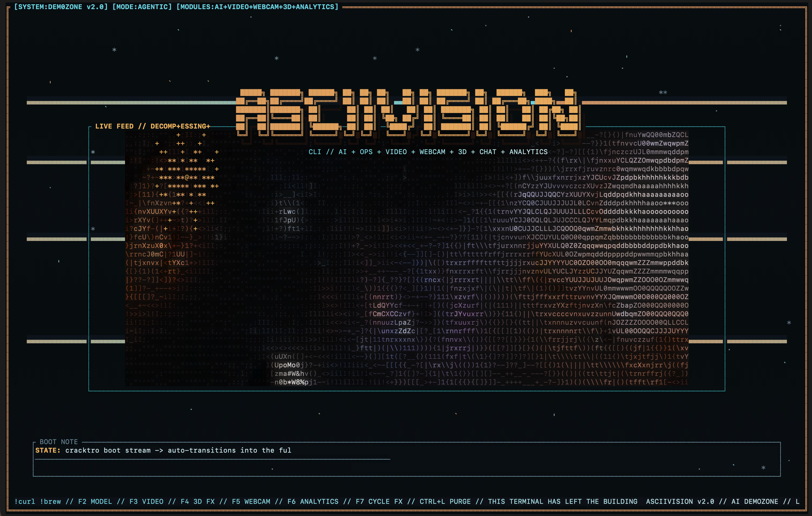

# ASCIIVision v3.0 -- All-In-One Terminal Powerhouse

> Agentic AI chat, ray-marched WebGL-style terminal graphics, a fuzzy command palette, live ASCII video, webcam streaming, multiplayer arcade games over WebSocket, room-code video chat, Hyprland-style tiling, system monitoring, conversation analytics -- all in one terminal app.



---

## What Is This

ASCIIVision is a single Rust binary that packs an absurd amount of functionality into your terminal:

- **Multi-AI Chat** -- Claude Haiku 4.5, Grok 4 Fast, GPT-5 Nano, Gemini 3 Flash, and local Ollama models with live provider switching
- **Streaming Responses** -- AI responses appear character-by-character in real-time via SSE streaming (Claude, OpenAI, Grok), with seamless tool-use handoff mid-stream
- **Agentic Tool Use** -- AI can autonomously execute shell commands, read/write files, search codebases, make HTTP requests, and query system info with configurable approval gates
- **Shell Execution** -- run any bash command inline with `!<cmd>`, plus `/curl` and `/brew` shortcuts
- **Video Playback** -- MP4 files and streamed YouTube sources decoded to real-time video via FFmpeg, with frame-rate-correct pacing. Renders as hi-res truecolor **half-blocks** (2x vertical resolution) by default, classic **ASCII glyphs**, or **true pixels** through the Kitty / iTerm2 / Sixel graphics protocols in terminals that support them -- auto-detected, with half-block as the universal fallback. `/vmode` cycles the three fidelity levels live
- **Live Webcam** -- your camera feed converted to ASCII art in real-time, with error reporting when the device is busy
- **Command Palette** -- Ctrl+P fuzzy-searches every command, effect, game, layout, and AI provider; Enter executes it
- **WebSocket Video Chat with Room Codes** -- `/host` starts a room and prints a short code; a friend types `/join <code>` -- no URLs, no IP hunting
- **Ray-Marched Terminal Graphics** -- SDF ray marching with real lighting (key/fill/specular/fresnel/fog/gamma) rendered in half-block subpixels: Torus Knot, Metaballs, Tunnel, Synthwave grid, Julia set, plus the classic six (matrix rain, plasma, starfield, wireframe cube, fire, particles)
- **Tiles Window** -- real PTY-backed embedded terminals for Codex, Claude, Gemini, shells, and any other CLI app, in 1-8 way grids
- **Hyprland-Style Tiling** -- move, swap, resize, and reassign panels with Ctrl+hjkl keybindings and 8 layout presets
- **Arcade with Online Multiplayer** -- seven games: Pong and Tron light cycles (vs AI, local 2-player, or online vs a `/host`//`/join` peer), Snake, Breakout, Pac-Man, Space Invaders, and 3D Penguin
- **System Monitor** -- live CPU, memory, swap, network I/O, load average, per-core sparklines
- **Conversation Analytics** -- real-time stats dashboard with message counts, provider breakdown, bar charts
- **Context Management** -- automatic summarization of older messages when the context window fills up, @-file injection, pinnable messages, persistent agent memory across sessions
- **SQLite Persistence** -- all conversations and agent memory saved to `~/.config/asciivision/conversations.db`
- **Cracktro Intro** -- animated boot sequence with starburst effects, raster bars, and scrolling ticker
- **Dynamic Theme Engine** -- global color theme system with HSL-based random palette generation. F9 randomizes all UI colors on the fly, F10 resets to defaults. Every panel, border, accent, and background color is driven by the live theme.

Legacy companion apps (mega-cli, mega-analytics) are preserved in the `archive/` directory.

---

## Quick Start

### One-Line Install (Recommended)

The install script handles everything -- Rust, FFmpeg, LLVM, `yt-dlp`, Ollama, building, and adding `asciivision` to your PATH:

```bash
git clone https://github.com/lalomorales22/asciivision.git
cd asciivision
./install.sh
```

After installation, run from anywhere:

```bash
asciivision
```

The repo includes `demo-videos/demo.mp4` as the bundled intro/video sample, so the video bus works out of the box.

**Supported platforms:** macOS (Homebrew), Ubuntu/Debian, Fedora/RHEL, Arch Linux, openSUSE.
**Windows users:** Install [WSL2](https://learn.microsoft.com/en-us/windows/wsl/install) first (`wsl --install` in PowerShell), then run the commands above inside your WSL terminal.

### Manual Setup

If you prefer to install dependencies yourself:

#### Prerequisites

- **Rust** 1.70+ ([rustup.rs](https://rustup.rs))
- **FFmpeg** dev libraries
- **LLVM/libclang** (needed to compile ffmpeg-sys-next)
- **pkg-config**
- **yt-dlp** (for `/youtube`)
- **Ollama** (for local model routing)

```bash
# macOS
brew install ffmpeg llvm pkg-config yt-dlp ollama

# Ubuntu/Debian
sudo apt install libavformat-dev libavcodec-dev libswscale-dev libavutil-dev libavdevice-dev pkg-config libclang-dev build-essential yt-dlp

# Fedora (enable RPM Fusion first)
sudo dnf install ffmpeg-devel clang-devel pkg-config gcc yt-dlp

# Arch
sudo pacman -S ffmpeg clang pkg-config base-devel yt-dlp

# Ollama (Linux / WSL2 manual install)
curl -fsSL https://ollama.com/install.sh | sh
```

#### Build & Run

```bash
# From the repo root (auto-builds + runs)
./asciivision

# Or manually
cargo build --release
./target/release/asciivision
```

### API Keys (Optional)

Copy `.env.example` to `.env` in the repo root and fill in your keys:

```bash
cp .env.example .env
```

Then edit `.env`:

```
CLAUDE_API_KEY=sk-ant-...
GROK_API_KEY=xai-...
OPENAI_API_KEY=sk-...
GEMINI_API_KEY=AIza...
```

Only the providers you want to use need keys. The app works without any keys -- shell, video, webcam, effects, tiling, sysmon, and local Ollama routing all work standalone.

---

## AI Models

| Provider | Model | Display Name |
|----------|-------|-------------|
| Anthropic | `claude-haiku-4-5` | Claude Haiku 4.5 |
| xAI | `grok-4-fast-non-reasoning` | Grok 4 Fast |
| OpenAI | `gpt-5-nano` | GPT-5 Nano |
| Google | `gemini-3-flash-preview` | Gemini 3 Flash |
| Ollama | installed models on this machine | Numbered local model picker |

Cycle between providers with F2 or `/provider <name>`. When you land on Ollama, ASCIIVision queries your local installed models and opens a numbered picker. Type the model number and press Enter to route chat into that model.

---

## CLI Flags

```
asciivision [OPTIONS]

Options:
  --provider <NAME>          AI provider: claude, grok, gpt, gemini, ollama [default: claude]
  --background-video <PATH>  MP4 file for the video panel
  --intro-video <PATH>       MP4 file for the intro sequence
  --skip-intro               Jump straight to the command deck
  --no-video                 Disable all video decoding
  --no-db                    Disable SQLite persistence
  --serve <PORT>             Start a WebSocket video chat server on this port
  --connect <URL>            Connect to a video chat server (ws://host:port)
  --username <NAME>          Username for video chat [default: anon]
  --webcam                   Enable webcam capture on startup
  --effects                  Start with 3D effects active
```

---

## Keyboard Controls

### Core

| Key | Action |
|-----|--------|
| `Ctrl+P` | **Command palette** -- fuzzy-search and run any command, effect, game, layout, or provider |
| `F1` | Help overlay (scrollable, generated from the live command registry) |
| `F2` | Cycle AI provider (Claude, Grok, GPT-5, Gemini, Ollama) |
| `F3` | Toggle video panel |
| `F4` | Cycle the 11 effects, then off, then repeat |
| `F5` | Toggle webcam capture |
| `F6` | Cycle tiling layout preset |
| `F7` | Boot/focus the Tiles PTY panel |
| `F8` | Cycle focused tile's panel type |
| `F9` | Randomize color theme |
| `F10` | Reset theme to defaults |
| `Ctrl+L` | Clear transcript |
| `Ctrl+C` | Exit |
| `Esc` | Exit (if input empty) / Clear input (if typing) |
| `PgUp/PgDn` | Scroll transcript |
| `Number + Enter` | Choose an Ollama model while the picker is open |

### Tiling (Hyprland-style)

| Key | Action |
|-----|--------|
| `Ctrl+h` | Focus tile to the left |
| `Ctrl+l` | Focus tile to the right |
| `Ctrl+k` | Focus tile above |
| `Ctrl+j` | Focus tile below |
| `Ctrl+H` | Swap focused tile left (Shift) |
| `Ctrl+L` | Swap focused tile right (Shift) |
| `Ctrl+K` | Swap focused tile up (Shift) |
| `Ctrl+J` | Swap focused tile down (Shift) |
| `Ctrl+[` | Shrink focused split |
| `Ctrl+]` | Grow focused split |
| `Ctrl+n` | Cycle focused tile to next panel type |

The focused tile is highlighted with a double border.

---

## Slash Commands

| Command | Description |
|---------|-------------|
| `!<cmd>` | Execute shell command (e.g., `!ls -la`, `!git status`) |
| `/curl <args>` | Shortcut for curl |
| `/brew <args>` | Shortcut for brew |
| `/provider <name>` | Switch AI provider |
| `/ollama` | Switch to Ollama and open the local model picker |
| `/video` | Toggle video panel |
| `/youtube <url>` | Resolve and stream a YouTube video into the video panel using `yt-dlp` |
| `/webcam` | Toggle webcam |
| `/vmode` | Cycle video fidelity: ASCII glyphs -> half-block (2x res) -> true pixels (Kitty/iTerm2/Sixel where supported) |
| `/screenshare` | Share your desktop as live ASCII; when in a room it streams into the call as your feed (mutes your camera) |
| `/3d` or `/effects` | Toggle 3D effects |
| `/fx` | Cycle effects, then off |
| `/fx <name>` | Jump straight to an effect (e.g. `/fx torus`, `/fx synthwave`) |
| `/host [port]` | Host a video chat room and print a shareable room code (default port 9999) |
| `/join <code>` | Join a friend's room by its short code |
| `/invite` | Re-print the room code and join instructions |
| `/disconnect` | Leave the current video chat room |
| `/analytics` | Show analytics in focused tile |
| `/games` | Show the games panel in the focused tile |
| `/games <name>` | Launch a game: pacman, space, penguin, pong, tron, snake, breakout |
| `/tiles` | Boot the Tiles panel with 2 live embedded terminals |
| `/tiles <1-8>` | Set the Tiles panel to a specific live terminal count |
| `/sysmon` | Show system monitor in focused tile |
| `/layout` | Cycle layout preset |
| `/layout <name>` | Set layout: default, dual, triple, quad, webcam, focus |
| `/server <port>` | Host WebSocket video chat server |
| `/connect ws://<addr>` | Join video chat server |
| `/chat <msg>` | Send message in video chat |
| `/username <name>` | Set your video chat username |
| `/clear` | Clear transcript |
| `/randomize` | Randomize all UI colors |
| `/theme reset` | Restore default color palette |
| `/help` | Toggle help overlay |

Anything that isn't a command goes to the AI as chat. Mistyped commands (`/hots`) are caught with a hint instead of silently burning AI tokens; to force something that looks like a command through to the AI anyway, start the line with a space.

`./install.sh` installs [`yt-dlp`](https://github.com/yt-dlp/yt-dlp) and Ollama for you. If you do a manual setup, make sure both are installed and available before using `/youtube` or the Ollama provider.
`/youtube` now streams directly into the video bus by resolving a playable media URL first, so it no longer has to cache the full video before playback starts.
Ollama model selection is populated from the local machine at runtime. ASCIIVision does not assume any default model names; it lists whatever Ollama reports as installed on that system.

---

## Tiling Layout Presets

| Preset | Description |
|--------|-------------|
| **Default** | Transcript (55%) + Video/3D Effects side-by-side top, Webcam/Telemetry+SysMon/Ops stacked right |
| **Dual Pane** | Transcript (50%) + 3D Effects/Webcam/SysMon stacked right |
| **Triple Column** | Three columns: transcript, video+3D effects, webcam+sysmon+ops |
| **Quad** | 2x2-ish grid: transcript, video, 3D effects, webcam+sysmon |
| **Webcam Focus** | Webcam top-right, 3D Effects below it, transcript+sysmon left |
| **Full Focus** | Single full-screen transcript |
| **Video Chat** | Remote feeds + chat + roster arranged for a call (applied automatically by `/host` and `/join`) |
| **Arcade** | Big games tile + transcript column (applied automatically by `/games`) |

Every tile can be reassigned to any of 13 panel types: Transcript, Games, Tiles, Video, Webcam, Telemetry, Ops Deck, 3D Effects, Analytics, Video Chat Feeds, Video Chat Messages, Video Chat Users, or System Monitor.

---

## Games Window

Run `/games` (applies the Arcade layout), pick a game from the palette (`Ctrl+P`, type its name), or focus a tile and press `F8`/`Ctrl+n` until it becomes `GAMES`.

- **Selection** -- number keys, arrow keys, or `WASD` choose between the seven games; `Enter` or `Space` launches
- **Play** -- `WASD`/arrows control the active game while the Games tile is focused and the input prompt is empty
- **Reset / Exit** -- `R` restarts the current game, `Esc` returns to the games selector

| Game | Modes |
|------|-------|
| **Pong** | vs AI, local 2-player (W/S vs arrows), online host/join |
| **Tron Light Cycles** | vs AI, local 2-player, online host/join |
| **Snake** | single-player, speed ramps as you grow |
| **Breakout** | single-player, 3 lives, theme-colored brick rows |
| **Pac-Man** | the classic, ghosts included |
| **Space Invaders** | the classic |
| **3D Penguin** | perspective-projected penguin playground |

### Online multiplayer

1. Connect two machines with `/host` on one and `/join <code>` on the other (see Video Chat below)
2. Both players open the same game (`/games pong` or `/games tron`)
3. One picks **HOST ONLINE**, the other picks **JOIN ONLINE** from the in-game mode menu
4. The handshake locks in automatically and the match starts with a countdown -- host runs the simulation, guest stays smooth with prediction

If a friend invites you while you're in the selector, a banner tells you exactly what to press.

---

## Tiles Window

Focus a tile and press `F8` or `Ctrl+n` until it becomes `TILES`, press `F7`, or run `/tiles`.

- **Default Layout** -- `/tiles` boots 2 live terminals side-by-side
- **Custom Counts** -- `/tiles 4` creates a 2x2 shell grid, and any count from `1` to `8` is supported
- **Real PTYs** -- each inner tile is a real terminal session, so you can launch `codex`, `claude`, `gemini`, or any other CLI tool directly inside it
- **Inner Focus** -- `Ctrl+j/k` cycles between inner terminals (next/previous)
- **Outer Focus** -- `Ctrl+h/l` moves between ASCIIVision panels (left/right), so you can jump back to chat or another module

---

## 3D Effects

Eleven terminal-rendered visual effects, cycled with `F4` or `/fx`, jumped to by name with `/fx <name>` or the palette. The five showpieces are true ray-marched/procedurally-shaded scenes drawn with half-block subpixels (double vertical resolution), two-light shading, fresnel rim, distance fog, and gamma correction -- a WebGL demo look, still 100% characters:

1. **Torus Knot** -- ray-marched rotating interlocked ring, specular-lit
2. **Metaballs** -- gooey smooth-min spheres orbiting and merging
3. **Tunnel** -- infinite fly-through with animated walls
4. **Synthwave** -- perspective grid, glowing horizon sun
5. **Julia** -- animated Julia-set zoom with smooth iteration coloring
6. **Rainbow Matrix Rain** -- cascading characters with per-column rainbow hues
7. **Plasma Field** -- sine-interference plasma, now in half-block subpixels
8. **3D Starfield** -- perspective-projected starfield with depth-based brightness
9. **Wireframe 3D** -- rotating cube with glow-line rendering
10. **Fire Simulation** -- bottom-up flame propagation with heat diffusion
11. **Particle Storm** -- particles with gravity and fade

All effects are frame-rate independent and budgeted to stay well under the 16ms frame tick.

---

## System Monitor

Live system telemetry panel (powered by `sysinfo`) showing:

- **CPU** -- global usage percentage with colored bar and per-core sparkline
- **Memory** -- used/total with bar graph, color-coded thresholds
- **Swap** -- usage with bar (if swap is active)
- **Network** -- upload/download bytes with arrow indicators
- **Load Average** -- 1/5/15 minute load
- **Cores** -- thread count

Thresholds: green (<50%), amber (50-80%), red (>80%) for CPU and memory.

---

## Webcam

Live camera capture converted to ASCII art using FFmpeg's AVFoundation (macOS), V4L2 (Linux), or DirectShow (Windows).

- Toggle with F5 or `/webcam`
- If another app (OBS, Zoom, FaceTime) has the camera locked, the panel shows a red error message explaining the conflict and how to fix it
- The capture thread is crash-safe (wrapped in `catch_unwind`) so a webcam failure never takes down the app
- Camera errors are surfaced in both the webcam panel and the status ticker

---

## WebSocket Video Chat

Multi-user live ASCII webcam streaming in the terminal. The easy way:

```
# Machine A (in the app):
/host                      -> prints  ROOM CODE: 82P22-DWBNH

# Machine B (same network, in the app):
/join 82P22-DWBNH
```

That's it -- `/host` starts the server, connects you to it, applies the Video Chat layout, and prints the code (codes are case- and dash-insensitive). `/invite` re-prints it, `/disconnect` leaves. Set your name with `/username <name>` before joining.

The manual way still works for cross-network or scripted setups:

```bash
asciivision --serve 8080                                          # host
asciivision --connect ws://192.168.1.100:8080 --username alice    # client (connects on launch)
```

Runtime commands: `/server 8080`, `/connect ws://host:port`, `/chat <msg>`. The video chat layout shows your own feed plus up to 3 remote feeds in a grid (with a "(you)" tag on yours), a chat stream, and a connected users list -- and once connected, Pong and Tron can be played online against anyone in the room. Dead connections are detected automatically on both ends, and if your opponent drops mid-match the game tells you instead of freezing.

---

## Project Structure

```
asciivision/
├── install.sh           # One-line installer (deps + build + PATH setup)
├── asciivision          # Launcher script (builds + runs)
├── Cargo.toml           # Main crate dependencies
├── .env.example         # API key template (copy to .env)
├── src/
│   ├── main.rs          # App shell: modes, rendering, input dispatch, tiling integration
│   ├── ai.rs            # Multi-provider AI client with streaming (Claude, Grok, GPT-5, Gemini, Ollama)
│   ├── commands.rs      # Command registry: single source of truth for every slash command
│   ├── palette.rs       # Ctrl+P fuzzy command palette
│   ├── shader.rs        # "ASCII GPU": SDF ray marcher, lighting, half-block subpixel drivers
│   ├── effects.rs       # Effects registry: 11 effects on a common trait
│   ├── games/           # Arcade: registry trait + 7 games (pong/tron with online netcode)
│   ├── roomcode.rs      # Short room codes <-> IPv4:port (Crockford base32) + LAN IP detection
│   ├── tools.rs         # Agentic tool definitions and execution (shell, files, search, HTTP, sysinfo)
│   ├── memory.rs        # Persistent agent memory (SQLite-backed key-value store)
│   ├── video.rs         # FFmpeg-based MP4 to ASCII art decoder
│   ├── webcam.rs        # Live webcam capture with ASCII conversion + error reporting
│   ├── shell.rs         # Async shell command execution with timeout
│   ├── db.rs            # SQLite conversation persistence
│   ├── tiling.rs        # Binary-tree tiling window manager with 8 presets + min-size enforcement
│   ├── theme.rs         # Global dynamic color theme engine with HSL random palette generation
│   ├── sysmon.rs        # System monitor (CPU, memory, network, load)
│   ├── analytics.rs     # Conversation analytics dashboard with bar charts
│   ├── server.rs        # WebSocket video chat + game relay server (protocol v2)
│   ├── client.rs        # WebSocket client (webcam, chat, game messages, keepalive)
│   └── message.rs       # WebSocket protocol message types
├── archive/
│   ├── mega-cli/        # Legacy standalone multi-AI chat app
│   └── mega-analytics/  # Legacy standalone analytics dashboard
└── demo-videos/         # Bundled sample video (`demo.mp4`) for intro/video playback
```

---

## Dependencies

| Category | Crates |
|----------|--------|
| Core | `ratatui`, `crossterm`, `tachyonfx`, `tokio`, `clap`, `anyhow` |
| Video | `ffmpeg-next`, `ffmpeg-sys-next`, `crossbeam-channel` |
| AI | `reqwest`, `serde`, `serde_json`, `dotenvy` |
| Networking | `tokio-tungstenite`, `futures`, `parking_lot`, `uuid` |
| System | `sysinfo`, `rusqlite`, `chrono`, `rand` |

---

## Requirements

- macOS, Linux, or Windows (via WSL2)
- Terminal with RGB color support (iTerm2, Kitty, Alacritty, WezTerm, etc.)
- A webcam (optional, for webcam/video chat features)
- Only one app can use the webcam at a time on macOS -- close OBS/Zoom/FaceTime before enabling webcam capture

All build dependencies and local-media extras (Rust, FFmpeg, LLVM, `yt-dlp`, Ollama) are installed automatically by `./install.sh`.
